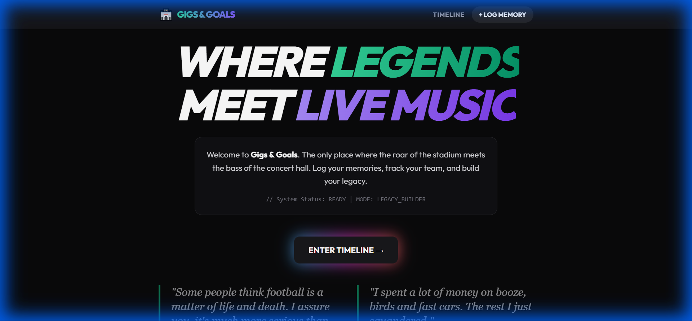
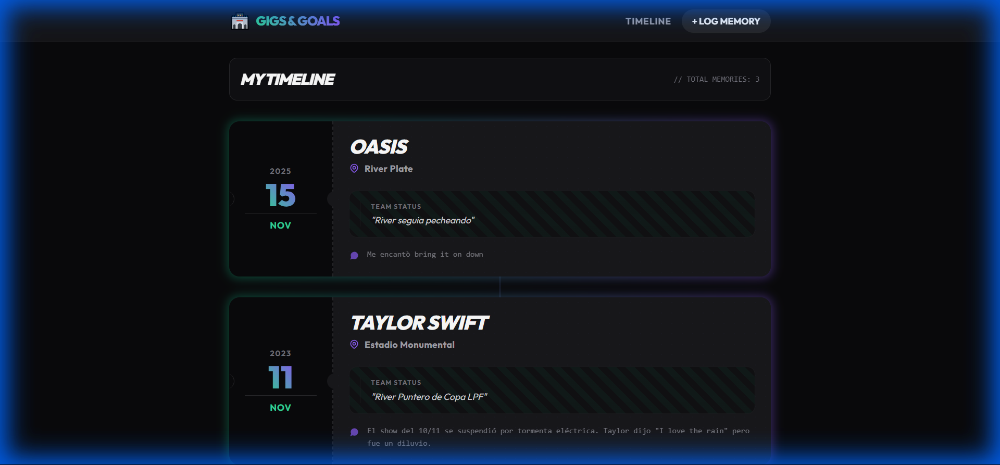
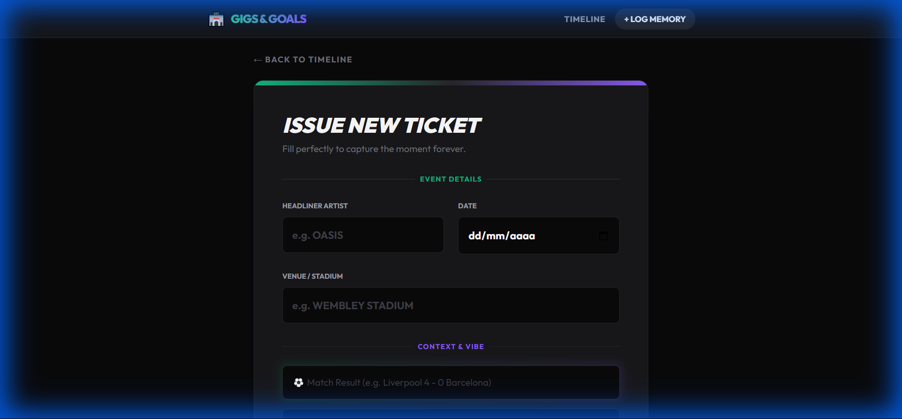

# Gigs & Goals 🏟️🎸

[](https://laravel.com)
[](https://tailwindcss.com)
[](https://www.php.net)
[](https://www.sqlite.org)

> **[🇺🇸 Read in English](README.md) | [🇪🇸 Leer en Español](README.es.md)**

🚀 **Live Demo:** [https://gigs-and-goals-dc5k06t2i-kaaduarturo4-8233s-projects.vercel.app](https://gigs-and-goals-dc5k06t2i-kaaduarturo4-8233s-projects.vercel.app)

**Gigs & Goals** es una línea de tiempo personal que conecta tus recuerdos musicales con tu pasión por el fútbol. Responde a la pregunta: *"¿Qué estaba haciendo mi equipo cuando vi a esta banda?"*

## Capturas de Pantalla

| Inicio | Mi Línea de Tiempo | Crear Recuerdo |
|:---:|:---:|:---:|
|  |  |  |

## Características

- **Vista de Línea de Tiempo**: Historial visual de conciertos asistidos, ordenados por fecha.
- **Memoria Contextual**:
  - **Detalles del Concierto**: Artista, Lugar, Fecha.
  - **Contexto Futbolístico**: Registra el estado de tu equipo (ej. "Peleando el título") y resultados del partido de ese día.
  - **Vibe Cultural**: Agrega tweets, anécdotas o el clima para capturar la "atmósfera" del día.
- **UI Premium**: Estética Dark Mode con acentos neón usando TailwindCSS.
- **Funcionalidad CRUD**: Sistema completo de Crear, Leer, Actualizar y Borrar tus recuerdos.

## Instalación y Desarrollo Local

1. **Clonar el repositorio**
   ```bash
   git clone <your-repo-url>
   cd gigs-and-goals
   ```

2. **Instalar Dependencias**
   ```bash
   composer install
   npm install
   ```

3. **Configurar Entorno**
   ```bash
   cp .env.example .env
   php artisan key:generate
   touch database/database.sqlite
   php artisan migrate
   ```

4. **Ejecutar Aplicación**
   ```bash
   npm run dev
   php artisan serve
   ```
   Visita `http://127.0.0.1:8000`

## Despliegue (Vercel)

Este proyecto está listo para desplegarse en Vercel, pero ten en cuenta que **las bases de datos SQLite son efímeras** en plataformas serverless como Vercel (los cambios no persisten tras nuevos deploys). Para una app de producción permanente, cambia a una base de datos remota MySQL/PostgreSQL (como Vercel Postgres, Supabase o PlanetScale).
